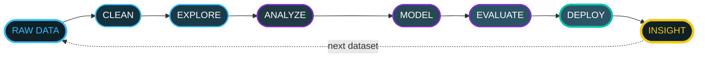
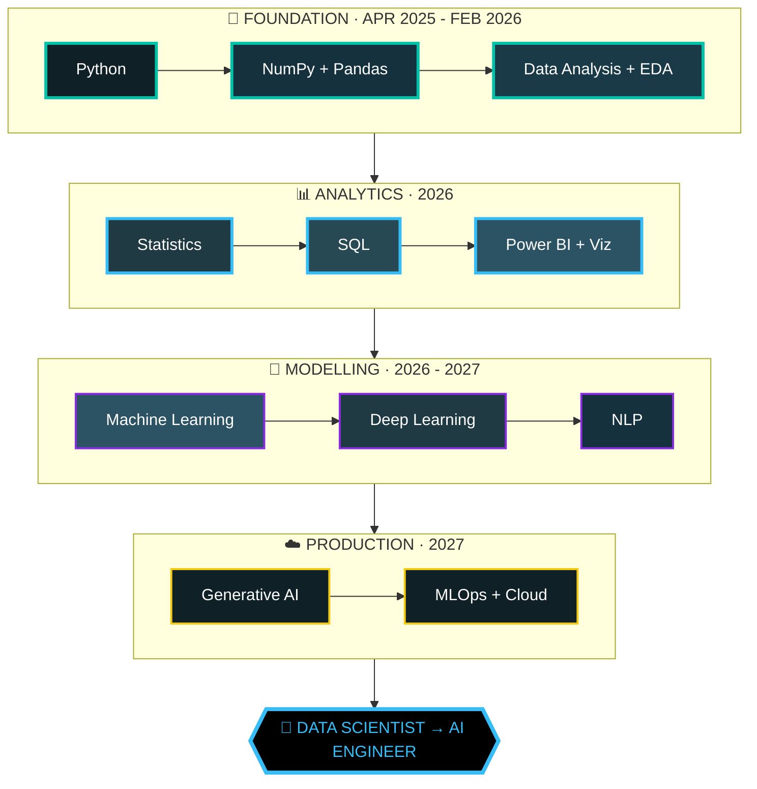
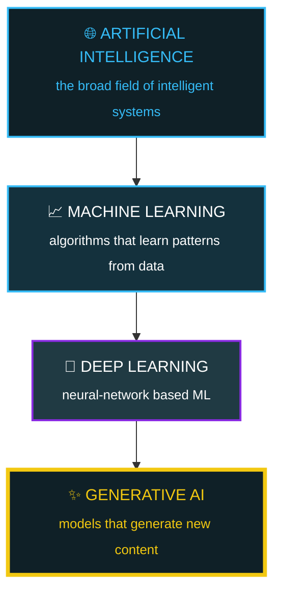
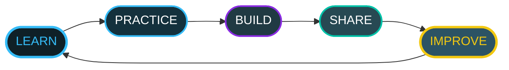

<!--
════════════════════════════════════════════════════════════════════════════
  NEERAJ SINGH DANU  ·  GITHUB PROFILE README   ·   v4 (PRODUCTION READY)
════════════════════════════════════════════════════════════════════════════
  ✅ All links are live
  ✅ All images render correctly
  ✅ All placeholders resolved
  ✅ Ready to copy-paste into GitHub
════════════════════════════════════════════════════════════════════════════
-->

<div align="center">


<a href="https://github.com/NEERAJSINGHDANU07">
  
</a>

<br/>


<br/><br/>


</div>

---

## 📊 ABOUT ME

<div align="center">

</div>

**I am Neeraj Singh Danu** — an aspiring Data Scientist who started from an empty terminal in **April 2025** and has been shipping in public ever since. No bootcamp certificate, no shortcut: just Python, real datasets, and the discipline to keep going after the tutorial ends.

What I actually care about is the **unglamorous half of data science** — the missing values nobody documented, the leakage hiding in a feature, the metric that flatters a model but lies to the business. I would rather present a boring model I fully understand than a fancy one I cannot explain. Every notebook in my repos is written so a reviewer can follow my reasoning, not just my results.

Right now I am deep in **Statistics, SQL and Machine Learning**, building Power BI dashboards on real datasets, and slowly opening the door to **Deep Learning and Generative AI**. The destination is **Data Scientist → AI Engineer**, and the roadmap further down this page is the actual plan I follow — not a wishlist.

<br/>

<div align="center">


</div>

---

## 🎯 QUICK SNAPSHOT

| **PROFILE** | **ROLE** | **LOCATION** | **MISSION** |
|:---:|:---:|:---:|:---:|
| **Neeraj Singh Danu** | **Aspiring Data Scientist** | **Haldwani, Uttarakhand 🇮🇳** | **Learn → Build → Deploy** |
| Self-taught, project-driven | Learning the full loop | Remote-friendly. Open to global collaboration | Every project ships something defensible |

---

## 💼 WHAT WORKING WITH ME LOOKS LIKE

| **IF YOU NEED** | **WHAT I BRING TODAY** | **HOW YOU CAN CHECK** |
|---|---|---|
| **A messy dataset made usable** | Pandas cleaning, type repair, missing-value strategy, sanity checks | Python Libraries for DS repo |
| **A claim tested, not guessed** | Hypothesis testing, distributions, regression, ANOVA — in Python | Statistics for DS repo |
| **A first model, honestly scored** | End-to-end sklearn pipelines, cross-validation, metrics that fit the problem | ML notebooks below |
| **Numbers a human can act on** | Power BI data models, DAX basics, charts that answer one question each | Dashboard work (in progress) |

---

## 🔬 CURRENT FOCUS AREAS

<div align="center">


</div>

---

## 🧠 MY DATA SCIENCE MINDSET



**This loop repeats for every dataset I touch — nothing skips a step.**

---

## 🛠️ TECH STACK

### ⚡ Languages & Core


### 📊 Data Science Stack


### 🤖 Machine Learning Techniques


### 🧰 Tools & Environment


### 📡 Currently Levelling Up


---

## 🚀 MY JOURNEY: DATA → AI

Started **April 2025** — every stage below is real work, not a wishlist.



| Status | Phase | Details |
|:---:|---|---|
| ✅ **DONE** | **FOUNDATION** | Core Python, NumPy, Pandas, Data Analysis |
| 🔄 **IN PROGRESS** | **ANALYTICS + ML** | Statistics, SQL, Power BI, Machine Learning |
| 🔮 **AHEAD** | **DEEP LEARNING** | Neural Networks, Advanced ML, Optimization |
| 🔮 **AHEAD** | **GENAI + MLOPS** | Large Language Models, Cloud Deployment |

---

## 🏆 FEATURED PROJECTS

### 📘 Learning Core Python
Structured notebooks covering Python fundamentals, OOP, error handling and file I/O — the foundation layer every later project builds on.

**Tech:** Python • Jupyter

[**View Repository →**](https://github.com/NEERAJSINGHDANU07/Learning-Core-Python)

---

### 📗 Python Libraries for Data Science
Hands-on notebooks with NumPy, Pandas, Matplotlib, Seaborn and scikit-learn — from array operations to a first end-to-end ML pipeline.

**Tech:** NumPy • Pandas • Matplotlib • scikit-learn

[**View Repository →**](https://github.com/NEERAJSINGHDANU07/Python-Libraries-for-DataScience)

---

### 📙 Statistics for Data Science
Probability, hypothesis testing, regression, ANOVA and distributions — worked through in Python. The mathematical backbone behind every model decision.

**Tech:** Statistics • SciPy • Python

[**View Repository →**](https://github.com/NEERAJSINGHDANU07/Statistics-for-DataScience)

---

### 📕 Portfolio Website
Personal portfolio built from scratch — skills, projects and learning journey in a clean, recruiter-friendly layout. Deployed and live.

**Tech:** HTML5 • CSS3 • JavaScript

[**Live Demo →**](https://neerajsinghdanu07.github.io/neerajsinghdanu.github.io/) | [**Code →**](https://github.com/NEERAJSINGHDANU07/neerajsinghdanu.github.io)

---

## 🔮 IN THE PIPELINE


---

## 🔄 HOW I SHIP A PROJECT

```mermaid
flowchart LR
    A[("DATASET")] --> B["DATA<br/>CLEANING"]
    B --> C["EDA"]
    C --> D["FEATURE<br/>ENGINEERING"]
    D --> E["TRAINING"]
    E --> F["EVALUATION"]
    F --> G["HYPERPARAMETER<br/>TUNING"]
    G -.->|if metrics fall short| D
    G --> H["EXPLAINABILITY"]
    H --> I[("DEPLOYMENT")]
    
    style A fill:#0F2027,stroke:#36BCF7,stroke-width:3px,color:#36BCF7
    style B fill:#14313D,stroke:#36BCF7,stroke-width:2px,color:#FFFFFF
    style C fill:#1A3A48,stroke:#8A2BE2,stroke-width:2px,color:#FFFFFF
    style D fill:#203A43,stroke:#8A2BE2,stroke-width:2px,color:#FFFFFF
    style E fill:#274953,stroke:#00C2A8,stroke-width:2px,color:#FFFFFF
    style F fill:#2C5364,stroke:#00C2A8,stroke-width:2px,color:#FFFFFF
    style G fill:#203A43,stroke:#F2C811,stroke-width:2px,color:#FFFFFF
    style H fill:#14313D,stroke:#F2C811,stroke-width:2px,color:#FFFFFF
    style I fill:#000000,stroke:#36BCF7,stroke-width:4px,color:#36BCF7
```



---

## 📊 GITHUB ANALYTICS

<div align="center">
<a href="https://github.com/NEERAJSINGHDANU07">
  
</a>
<a href="https://github.com/NEERAJSINGHDANU07">
  
</a>
</div>

<br/>

<div align="center">
<a href="https://github.com/NEERAJSINGHDANU07">
  
</a>
</div>

<br/>

<div align="center">
<a href="https://github.com/NEERAJSINGHDANU07">
  
</a>
</div>

<br/>

<div align="center">
<a href="https://github.com/NEERAJSINGHDANU07">
  
</a>
</div>

---

## 🌌 AI / ML CONCEPT HIERARCHY



---

## 💭 LEARNING PHILOSOPHY

> **"Every dataset tells a story. My job is to uncover it."**



This is not a destination — it's a loop that repeats forever.

---

## 🗺️ ROADMAP: APR 2025 → 2027

```
TIMELINE:
    April 2025    ✅ Foundation laid (Python, NumPy, Pandas, EDA)
    June 2026     🔄 Analytics + ML phase (Statistics, SQL, Power BI, ML Models)
    Jan 2027      🔮 Deep Learning phase (Neural Networks, NLP)
    July 2027     🔮 GenAI + MLOps phase (Production deployment)
    
MILESTONES:
    ✅ Core Python mastered
    ✅ Data cleaning & EDA pipeline solid
    🔄 Statistical testing & SQL querying
    🔄 First 4 ML projects shipped
    🔮 Deep Learning fundamentals
    🔮 Cloud deployment & MLOps basics
    
GOAL: Data Scientist → AI Engineer by end of 2027
```

---

## 🌐 CONNECT WITH ME

<div align="center">
<a href="https://github.com/NEERAJSINGHDANU07"></a>
<a href="https://linkedin.com/in/neerajsinghdanu"></a>
<a href="https://www.youtube.com/@CODEVERTEX-k7c"></a>
<a href="mailto:neerajdanu07@gmail.com"></a>
<a href="https://neerajsinghdanu07.github.io/neerajsinghdanu.github.io/"></a>
</div>

<br/>

<div align="center">

</div>

---

## 🚀 BUILDING THE FUTURE, ONE DATASET AT A TIME

**Consistency today → Mastery tomorrow**

⭐ **If any of this resonates with you, a follow or a star means a lot.**

---

<div align="center">
<sub>Last updated: September 2026 | Building in public since April 2025</sub>
</div>
