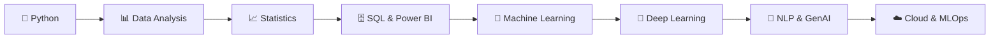

<div align="center">


<a href="https://github.com/NEERAJSINGHDANU07">
  
</a>

<br/>


</div>

---

## 🧑‍💻 About Me


```yaml
name:      "Neeraj Singh Danu"
location:  "Haldwani, Uttarakhand, India 🇮🇳"
role:      "Aspiring Data Scientist"
languages: ["Python", "SQL"]
learning:  ["Machine Learning", "Generative AI", "Power BI"]
mission:   "Learn continuously, build consistently."
```

- 🌱 Currently mastering **Machine Learning** & **Generative AI**
- 📊 I love transforming raw data into meaningful insights through **EDA** and **visualization**
- 🤝 Open to collaborating on **Data Analytics**, **Python**, and **AI** projects
- 💡 *"Every dataset tells a story — my job is to uncover it."*
- 📫 Reach me at **neerajdanu07@gmail.com**

<br clear="right"/>

---

## 🛠️ Tech Stack

<div align="center">

### Languages & Core


### Data Science & ML


### Tools & Platforms


</div>

---

## 🚀 Featured Projects

<table>
<tr>
<td width="50%">

### 🐍 Learning Core Python
Structured notebooks covering Python from basics to OOP, error handling & file I/O.

`Python` `Jupyter`

</td>
<td width="50%">

### 📚 Python Libraries for Data Science
Hands-on guides for NumPy, Pandas, Matplotlib, Seaborn & scikit-learn.

`Pandas` `NumPy` `Visualization`

</td>
</tr>
<tr>
<td width="50%">

### 📈 Statistics for Data Science
Probability, hypothesis testing, regression, ANOVA & distributions.

`Statistics` `Analytics`

</td>
<td width="50%">

### 🌐 Portfolio Website
Personal portfolio showcasing skills, projects & journey.

`HTML` `CSS` `JavaScript`

</td>
</tr>
</table>

<div align="center">

[](https://neerajsinghdanu07.github.io/neerajsinghdanu.github.io/)
[](https://agent-6a0ab1f8ca1265c--iridescent-gumdrop-325a80.netlify.app)

</div>

---

## 📊 Learning Progress

```text
Python              ████████████████░░░░  85%
Statistics          ███████████████░░░░░  75%
SQL                 ██████████████░░░░░░  70%
Power BI            ████████████░░░░░░░░  60%
Machine Learning    ███████████░░░░░░░░░  55%
Deep Learning       ████░░░░░░░░░░░░░░░░  20%
```

---

## 📈 GitHub Analytics

<div align="center">


<br/>


<br/>


<br/>


</div>

---

## 🗺️ Roadmap 2025 → 2027



---

## 🐍 Contribution Snake

<div align="center">

</div>

---

## 🤝 Connect With Me

<div align="center">

[](https://linkedin.com/in/neerajsinghdanu)
[](http://www.youtube.com/@CODEVERTEX-k7c)
[](mailto:neerajdanu07@gmail.com)
[](https://neerajsinghdanu07.github.io/neerajsinghdanu.github.io/)

</div>

---

<div align="center">

### 💭 *"The best way to predict the future is to build it."*


**⭐ If you like my work, consider following my journey!**

</div>
