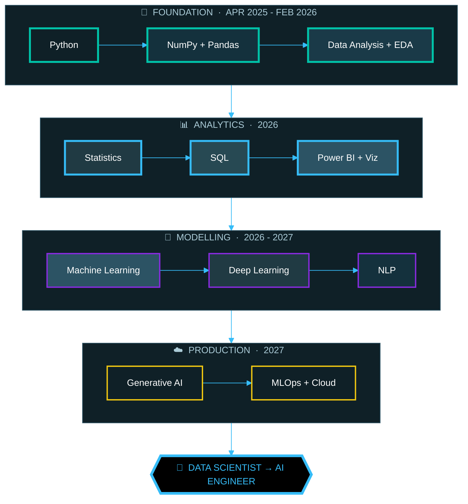
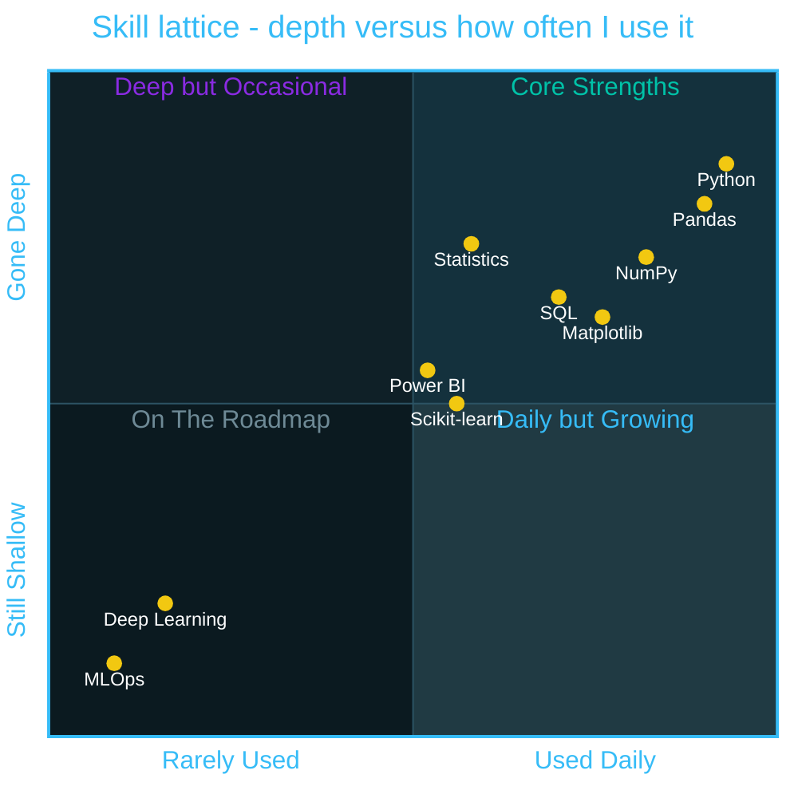
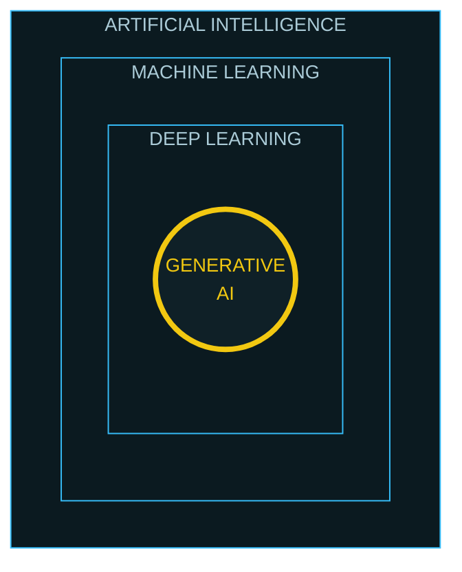
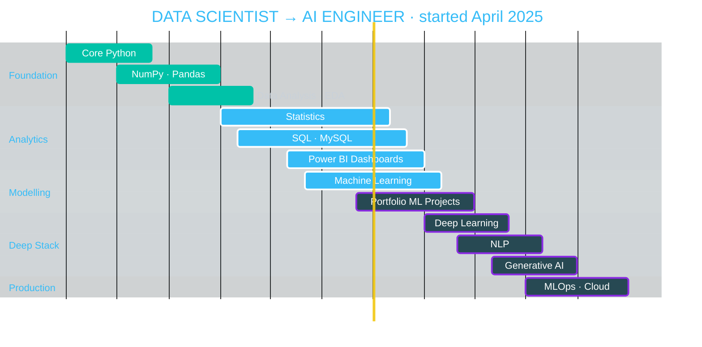

```mermaid
%%{init: {'theme':'base','themeVariables':{'fontFamily':'Fira Code, monospace','fontSize':'14px','primaryColor':'#203A43','primaryTextColor':'#FFFFFF','primaryBorderColor':'#36BCF7','lineColor':'#00C2A8'}}}%%
flowchart LR
    A[("DATASET")] --> B["DATA<br/>CLEANING"]
    B --> C["EDA"]
    C --> D["FEATURE<br/>ENGINEERING"]
    D --> E["TRAINING"]
    E --> F["EVALUATION"]
    F --> G["HYPERPARAMETER<br/>TUNING"]
    G -.->|"if metrics<br/>fall short"| D
    G --> H["EXPLAINABILITY"]
    H --> I[("DEPLOYMENT")]

    style A fill:#0F2027,stroke:#36BCF7,stroke-width:3px,color:#36BCF7
    style B fill:#14313D,stroke:#36BCF7,stroke-width:2px,color:#FFFFFF
    style C fill:#1A3A48,stroke:#8A2BE2,stroke-width:2px,color:#FFFFFF
    style D fill:#203A43,stroke:#8A2BE2,stroke-width:2px,color:#FFFFFF
    style E fill:#274953,stroke:#00C2A8,stroke-width:2px,color:#FFFFFF
    style F fill:#2C5364,stroke:#00C2A8,stroke-width:2px,color:#FFFFFF
    style G fill:#203A43,stroke:#F2C811,stroke-width:2px,color:#FFFFFF
    style H fill:#14313D,stroke:#F2C811,stroke-width:2px,color:#FFFFFF
    style I fill:#000000,stroke:#36BCF7,stroke-width:4px,color:#36BCF7
```

<!--
════════════════════════════════════════════════════════════════════════════
  NEERAJ SINGH DANU  ·  GITHUB PROFILE README   ·   v3 (3D / VFX build)
════════════════════════════════════════════════════════════════════════════
  BEFORE YOU COMMIT — replace these 2 things:
    1. Search "REPLACE-REPO" -> swap in your 4 real repository URLs
    2. Check the ROADMAP gantt dates still match your plan (starts April 2025)
  Everything in this file works on paste. No extra files needed.
  OPTIONAL true-animated 3D upgrades are documented at the very bottom.
════════════════════════════════════════════════════════════════════════════
-->
<div align="center">

<a href="https://github.com/NEERAJSINGHDANU07">
  
</a>
<br/>


<br/><br/>

</div>

<!-- ══════════════ 3D HOLOGRAPHIC IDENTITY CARD ══════════════════════ -->
<div align="center">

<br/>

</div>

```
  ▁▁▁▁▁▁▁▁▁▁▁▁▁▁▁▁▁▁▁▁▁▁▁▁▁▁▁▁▁▁▁▁▁▁▁▁▁▁▁▁▁▁▁▁▁▁▁▁▁▁▁▁▁▁▁▁▁▁▁▁▁▁▁▁▁▁▁▁▁▁▁▁
  ╱░░░░░░░░░░░░░░░░░░░░░░░░░░░░░░░░░░░░░░░░░░░░░░░░░░░░░░░░░░░░░░░░░░░░░░╲
   ╱░░░░░░░░░░░░░░░░░░░░░░░░░░░░░░░░░░░░░░░░░░░░░░░░░░░░░░░░░░░░░░░░░░░░╲
    ╔══════════════════════════════════════════════════════════════════╗
    ║  ░▒▓█  D A T A   S C I E N C E   D I V I S I O N  █▓▒░           ║▓
    ╠══════════════════════════════════════════════════════════════════╣▓
    ║  ┌──────────┐   NAME     NEERAJ SINGH DANU                       ║▓
    ║  │ ▓▓▓▓▓▓▓▓ │   ROLE     Aspiring Data Scientist                 ║▓
    ║  │ ▓▓ NSD ▓ │   BASE     Haldwani · Uttarakhand · India          ║▓
    ║  │ ▓▓▓▓▓▓▓▓ │   SINCE    April 2025   ·   16 months in           ║▓
    ║  └──────────┘   STATE    ◉ ACTIVE  ·  OPEN TO WORK               ║▓
    ╠══════════════════════════════════════════════════════════════════╣▓
    ║  CORE     Python  ·  SQL  ·  Statistics                          ║▓
    ║  STACK    Pandas · NumPy · scikit-learn · Matplotlib             ║▓
    ║  BI       Power BI  ·  Excel  ·  MySQL                           ║▓
    ║  TARGET   Data Scientist   ──▶   AI Engineer                     ║▓
    ╠══════════════════════════════════════════════════════════════════╣▓
    ║  ▌│▌▌│▌│▌▌▌│▌│▌▌│▌▌│▌│▌▌▌│▌│▌▌│▌│▌▌▌│▌▌│▌│▌▌│▌│▌▌   NSD·2025     ║▓
    ╚══════════════════════════════════════════════════════════════════╝▓
     ▓▓▓▓▓▓▓▓▓▓▓▓▓▓▓▓▓▓▓▓▓▓▓▓▓▓▓▓▓▓▓▓▓▓▓▓▓▓▓▓▓▓▓▓▓▓▓▓▓▓▓▓▓▓▓▓▓▓▓▓▓▓▓▓▓▓▓
       ╲                                                              ╱
          ╲                                                        ╱
             ╲                                                  ╱
                ╲                                            ╱
                 ▀▀▀▀▀▀▀ H O L O - P R O J E C T O R ▀▀▀▀▀▀▀▀
```

<div align="center">

<br/>


<br/><br/>

<br/>

</div>

<!-- ═════════════════════════════ ABOUT ME ════════════════════════════ -->
<div align="center">

<br/>

</div>

<p align="center">
<b>I am Neeraj Singh Danu</b> — an aspiring Data Scientist who started from an empty terminal in
<b>April 2025</b> and has been shipping in public ever since. No bootcamp certificate, no shortcut:
just Python, real datasets, and the discipline to keep going after the tutorial ends.
<br/><br/>
What I actually care about is the <b>unglamorous half of data science</b> — the missing values nobody
documented, the leakage hiding in a feature, the metric that flatters a model but lies to the business.
I would rather present a boring model I fully understand than a fancy one I cannot explain.
Every notebook in my repos is written so a reviewer can follow my reasoning, not just my results.
<br/><br/>
Right now I am deep in <b>Statistics, SQL and Machine Learning</b>, building Power BI dashboards on real
datasets, and slowly opening the door to <b>Deep Learning and Generative AI</b>. The destination is
<b>Data Scientist → AI Engineer</b>, and the roadmap further down this page is the actual plan I follow —
not a wishlist.
</p>

<div align="center">


</div>

<table align="center" width="100%">
<tr>
<td width="25%" align="center" valign="top">
<h3>🧬 &nbsp;PROFILE</h3>
<b>Neeraj Singh Danu</b>
<br/><br/>
<sub>Building a career at the intersection of data, statistics and intelligent systems. Self-taught, project-driven, consistent since April 2025.</sub>
</td>
<td width="25%" align="center" valign="top">
<h3>🎯 &nbsp;ROLE</h3>
<b>Aspiring Data Scientist</b>
<br/><br/>
<sub>Learning the full loop — raw data, clean features, honest evaluation, explainable models.</sub>
</td>
<td width="25%" align="center" valign="top">
<h3>📍 &nbsp;LOCATION</h3>
<b>Haldwani, Uttarakhand 🇮🇳</b>
<br/><br/>
<sub>Remote-friendly. Open to collaboration across India and globally.</sub>
</td>
<td width="25%" align="center" valign="top">
<h3>🚀 &nbsp;MISSION</h3>
<b>Learn → Build → Deploy</b>
<br/><br/>
<sub>A continuous loop, not a one-time goal. Every project ships something I can defend.</sub>
</td>
</tr>
</table>

<div align="center">
<b>🧾 &nbsp;WHAT WORKING WITH ME LOOKS LIKE</b>
<br/><br/>
<table>
<tr>
<th align="left">IF YOU NEED</th>
<th align="left">WHAT I BRING TODAY</th>
<th align="left">HOW YOU CAN CHECK</th>
</tr>
<tr>
<td><b>A messy dataset made usable</b></td>
<td><sub>Pandas cleaning, type repair, missing-value strategy, sanity checks before any modelling</sub></td>
<td><sub>Python Libraries for DS repo</sub></td>
</tr>
<tr>
<td><b>A claim tested, not guessed</b></td>
<td><sub>Hypothesis testing, distributions, regression, ANOVA — worked out in Python, not quoted from a slide</sub></td>
<td><sub>Statistics for DS repo</sub></td>
</tr>
<tr>
<td><b>A first model, honestly scored</b></td>
<td><sub>End-to-end sklearn pipelines, cross-validation, and a metric chosen for the problem, not for the leaderboard</sub></td>
<td><sub>ML notebooks + pipeline below</sub></td>
</tr>
<tr>
<td><b>Numbers a human can act on</b></td>
<td><sub>Power BI data models, DAX basics, and charts that answer one question each</sub></td>
<td><sub>Dashboard work in progress</sub></td>
</tr>
</table>
<br/>
<b>🔬 &nbsp;CURRENT FOCUS AREAS</b>
<br/><br/>


<br/>

</div>

<!-- ═══════════════════════ DATA SCIENCE MINDSET ══════════════════════ -->
<div align="center">

</div>


<div align="center">
<i>This loop repeats for every dataset I touch — nothing skips a step.</i>

</div>

<!-- ════════════════════════════ TECH STACK ═══════════════════════════ -->
<div align="center">

<br/>
<b>⚡ &nbsp;LANGUAGES & CORE</b>
<br/><br/>

<br/><br/>
<b>📊 &nbsp;DATA SCIENCE STACK</b>
<br/><br/>


<br/><br/>
<b>🤖 &nbsp;MACHINE LEARNING</b>
<br/><br/>


<br/>


<br/><br/>
<b>🧰 &nbsp;TOOLS & ENVIRONMENT</b>
<br/><br/>

<br/>


<br/>


<br/><br/>
<b>📡 &nbsp;CURRENTLY LEVELLING UP</b>
<br/><br/>


<br/>

</div>

<!-- ═══════════════════════ JOURNEY: DATA TO AI ═══════════════════════ -->
<div align="center">

<br/>
<sub><i>Started April 2025 — every stage below is a real block of study, not a plan on paper.</i></sub>
</div>



<div align="center">


</div>

<!-- ═════════════════ 3D SKILL LATTICE / POSITIONING ══════════════════ -->
<div align="center">

<br/>

<br/>
<b>▶ &nbsp;EXTRUDED DEPTH TOWERS</b>
<br/>
<sub><i>Self-tracked against my own roadmap — not a certification claim.</i></sub>
</div>

```
               0────────────────────────DEPTH ▶ 100
                ▄▄▄▄▄▄▄▄▄▄▄▄▄▄▄▄▄▄▄▄▄▄▄▄▄▄▄
PYTHON         ███████████████████████████▒▒▒▒▒   86  COMFORTABLE
                ▀▀▀▀▀▀▀▀▀▀▀▀▀▀▀▀▀▀▀▀▀▀▀▀▀▀▀   ↳ OOP · files · clean reusable scripts

                ▄▄▄▄▄▄▄▄▄▄▄▄▄▄▄▄▄▄▄▄▄▄
STATISTICS     ██████████████████████▒▒▒▒▒▒▒▒▒▒   70  BUILDING
                ▀▀▀▀▀▀▀▀▀▀▀▀▀▀▀▀▀▀▀▀▀▀   ↳ hypothesis tests · regression · ANOVA

                ▄▄▄▄▄▄▄▄▄▄▄▄▄▄▄▄▄▄▄▄
SQL · MYSQL    ████████████████████▒▒▒▒▒▒▒▒▒▒▒▒   64  BUILDING
                ▀▀▀▀▀▀▀▀▀▀▀▀▀▀▀▀▀▀▀▀   ↳ joins · subqueries · window functions

                ▄▄▄▄▄▄▄▄▄▄▄▄▄▄▄▄▄
POWER BI       █████████████████▒▒▒▒▒▒▒▒▒▒▒▒▒▒▒   54  BUILDING
                ▀▀▀▀▀▀▀▀▀▀▀▀▀▀▀▀▀   ↳ data modelling · DAX basics · reports

                ▄▄▄▄▄▄▄▄▄▄▄▄▄▄▄
SCIKIT-LEARN   ███████████████▒▒▒▒▒▒▒▒▒▒▒▒▒▒▒▒▒   48  LEARNING
                ▀▀▀▀▀▀▀▀▀▀▀▀▀▀▀   ↳ pipelines · cross-val · metric choice

                ▄▄▄▄▄▄
DEEP LEARNING  ██████▒▒▒▒▒▒▒▒▒▒▒▒▒▒▒▒▒▒▒▒▒▒▒▒▒▒   20  EXPLORING
                ▀▀▀▀▀▀   ↳ backprop intuition · net fundamentals
```

<div align="center">
<b>▶ &nbsp;SKILL POSITIONING MAP</b>
<br/>
<sub><i>Where each skill sits — how deep I have gone versus how often I actually reach for it.</i></sub>
</div>



<div align="center">


</div>

<!-- ═════════════════════════ FEATURED PROJECTS ═══════════════════════ -->
<div align="center">

</div>

<table align="center" width="100%">
<tr>
<td width="50%" valign="top">
<h3>📘 &nbsp;Learning Core Python</h3>
<sub>Structured notebooks covering Python fundamentals, OOP, error handling and file I/O — the foundation layer every later project builds on.</sub>
<br/><br/>


<br/><br/>
<!-- REPLACE-REPO-1 : point this at the real repository -->
<a href="https://github.com/NEERAJSINGHDANU07?tab=repositories"></a>
</td>
<td width="50%" valign="top">
<h3>📗 &nbsp;Python Libraries for Data Science</h3>
<sub>Hands-on notebooks with NumPy, Pandas, Matplotlib, Seaborn and scikit-learn — from array operations to a first end-to-end ML pipeline.</sub>
<br/><br/>


<br/><br/>
<!-- REPLACE-REPO-2 : point this at the real repository -->
<a href="https://github.com/NEERAJSINGHDANU07?tab=repositories"></a>
</td>
</tr>
<tr>
<td width="50%" valign="top">
<h3>📙 &nbsp;Statistics for Data Science</h3>
<sub>Probability, hypothesis testing, regression, ANOVA and distributions — worked through in Python. The mathematical backbone behind every model decision.</sub>
<br/><br/>


<br/><br/>
<!-- REPLACE-REPO-3 : point this at the real repository -->
<a href="https://github.com/NEERAJSINGHDANU07?tab=repositories"></a>
</td>
<td width="50%" valign="top">
<h3>📕 &nbsp;Portfolio Website</h3>
<sub>Personal portfolio built from scratch — skills, projects and learning journey in a clean, recruiter-friendly layout. Deployed and live.</sub>
<br/><br/>


<br/><br/>
<a href="https://neerajsinghdanu07.github.io/neerajsinghdanu.github.io/"></a>
<!-- REPLACE-REPO-4 : point this at the real repository -->
<a href="https://github.com/NEERAJSINGHDANU07?tab=repositories"></a>
</td>
</tr>
</table>

<div align="center">
<b>🔮 &nbsp;IN THE PIPELINE</b>
<br/><br/>


<br/>


</div>

<!-- ═════════════════════════ PROJECT PIPELINE ════════════════════════ -->
<div align="center">

</div>



<div align="center">

</div>

<!-- ═════════════════════════ GITHUB ANALYTICS ════════════════════════ -->
<div align="center">

<br/>


<br/>

<br/><br/>

<br/>


</div>

<!-- ══════════════════════ AI / ML CONCEPT MAP ════════════════════════ -->
<div align="center">

</div>



<div align="center">
<table>
<tr>
<td align="center"><b>🌐 AI</b><br/><sub>the broad field of<br/>intelligent systems</sub></td>
<td align="center"><b>📈 ML</b><br/><sub>algorithms that learn<br/>patterns from data</sub></td>
<td align="center"><b>🧠 DL</b><br/><sub>neural-network<br/>based ML</sub></td>
<td align="center"><b>✨ GenAI</b><br/><sub>models that generate<br/>new content</sub></td>
</tr>
</table>

</div>

<!-- ══════════════════ WHAT I BUILD · FABRICATION BAY ═════════════════ -->
<div align="center">

<br/>

</div>

```
  ╔══════════════════════════════════════════════════════════════════════╗
  ║  ▓▒░  F A B R I C A T I O N   B A Y  ░▒▓          6 / 6  ONLINE      ║
  ╚══════════════════════════════════════════════════════════════════════╝

    ▗▄▄▄▄▄▄▄▄▄▄▄▄▄▖   ▗▄▄▄▄▄▄▄▄▄▄▄▄▄▖   ▗▄▄▄▄▄▄▄▄▄▄▄▄▄▖
    ▐  ANALYTICS  ▌▓  ▐  ML MODELS  ▌▓  ▐ AI SYSTEMS  ▌▓
    ▝▀▀▀▀▀▀▀▀▀▀▀▀▀▘▓  ▝▀▀▀▀▀▀▀▀▀▀▀▀▀▘▓  ▝▀▀▀▀▀▀▀▀▀▀▀▀▀▘▓
      ░ ░ ░ ░ ░        ░ ░ ░ ░ ░        ░ ░ ░ ░ ░

    ▗▄▄▄▄▄▄▄▄▄▄▄▄▄▖   ▗▄▄▄▄▄▄▄▄▄▄▄▄▄▖   ▗▄▄▄▄▄▄▄▄▄▄▄▄▄▖
    ▐ DASHBOARDS  ▌▓  ▐ FORECASTING ▌▓  ▐ AUTOMATION  ▌▓
    ▝▀▀▀▀▀▀▀▀▀▀▀▀▀▘▓  ▝▀▀▀▀▀▀▀▀▀▀▀▀▀▘▓  ▝▀▀▀▀▀▀▀▀▀▀▀▀▀▘▓
      ░ ░ ░ ░ ░        ░ ░ ░ ░ ░        ░ ░ ░ ░ ░

  ▀▀▀▀▀▀▀▀▀▀▀▀▀▀▀▀▀▀▀▀▀  O U T P U T   R A I L  ▀▀▀▀▀▀▀▀▀▀▀▀▀▀▀▀▀▀▀▀▀▀
```

<table align="center" width="100%">
<tr>
<td align="center" width="33.3%" valign="top">
<h3>📊</h3>
<b>DATA ANALYTICS</b>
<br/>
<sub>Turning messy raw data into a decision someone can actually act on</sub>
<br/><br/>

<br/>


</td>
<td align="center" width="33.3%" valign="top">
<h3>🤖</h3>
<b>ML MODELS</b>
<br/>
<sub>Regression through to ensembles, scored on a metric that fits the problem</sub>
<br/><br/>

<br/>


</td>
<td align="center" width="33.3%" valign="top">
<h3>🧠</h3>
<b>AI SYSTEMS</b>
<br/>
<sub>Learning-driven pipelines that improve as more data arrives</sub>
<br/><br/>

<br/>


</td>
</tr>
<tr>
<td align="center" width="33.3%" valign="top">
<h3>📈</h3>
<b>DASHBOARDS</b>
<br/>
<sub>Power BI models and data storytelling — one question per chart</sub>
<br/><br/>

<br/>


</td>
<td align="center" width="33.3%" valign="top">
<h3>🔍</h3>
<b>FORECASTING</b>
<br/>
<sub>Trend detection and prediction with the uncertainty stated out loud</sub>
<br/><br/>

<br/>


</td>
<td align="center" width="33.3%" valign="top">
<h3>🔁</h3>
<b>AUTOMATION</b>
<br/>
<sub>Python-powered workflows that kill the repetitive parts of the job</sub>
<br/><br/>

<br/>


</td>
</tr>
</table>

<div align="center">

</div>

<!-- ═════════════════════════════ PHILOSOPHY ══════════════════════════ -->
<div align="center">

<br/>

</div>


<div align="center">

</div>

<!-- ════════════════════════════ ROADMAP ══════════════════════════════ -->
<div align="center">

</div>



<div align="center">


</div>

<!-- ═════════════════════════════ CONNECT ═════════════════════════════ -->
<div align="center">

<br/>
<a href="https://github.com/NEERAJSINGHDANU07"></a>
<a href="https://linkedin.com/in/neerajsinghdanu"></a>
<a href="https://www.youtube.com/@CODEVERTEX-k7c"></a>
<a href="mailto:neerajdanu07@gmail.com"></a>
<a href="https://neerajsinghdanu07.github.io/neerajsinghdanu.github.io/"></a>
<br/><br/>


<h2>🚀 &nbsp;BUILDING THE FUTURE, ONE DATASET AT A TIME</h2>
<h3>Consistency today → Mastery tomorrow</h3>
<sub>⭐ If any of this is useful to you, a follow or a star means a lot.</sub>
<br/>

</div>

<!--
════════════════════════════════════════════════════════════════════════════
  OPTIONAL UPGRADE A — TRUE ANIMATED 3D SVG (rotating holo ID card)
════════════════════════════════════════════════════════════════════════════
  GitHub strips CSS and JS from README markdown, so nothing inside this file
  can rotate on its own. BUT an SVG loaded as an  is a separate document
  and its animation DOES play. So: commit the two SVG files that came with
  this README into an "assets" folder in your profile repo, then swap the
  ASCII blocks for these lines.

    1. Create the folder:      assets/
    2. Add the files:          assets/holo-id-3d.svg
                               assets/skill-lattice-3d.svg
    3. Replace the ASCII ID card block with:

       <div align="center">
         
       </div>

    4. Replace the ASCII depth-tower block with:

       <div align="center">
         
       </div>

  Keep the ASCII versions commented out as a fallback if you ever move repos.

════════════════════════════════════════════════════════════════════════════
  OPTIONAL UPGRADE B — 3D ISOMETRIC CONTRIBUTION CALENDAR (your real data)
════════════════════════════════════════════════════════════════════════════
  Create .github/workflows/profile-3d.yml with:
      name: GitHub-Profile-3D-Contrib
      on:
        schedule: [{ cron: "0 18 * * *" }]
        workflow_dispatch:
      jobs:
        build:
          runs-on: ubuntu-latest
          permissions:
            contents: write
          steps:
            - uses: actions/checkout@v4
            - uses: yoshi389111/github-profile-3d-contrib@main
              env:
                GITHUB_TOKEN: ${{ secrets.GITHUB_TOKEN }}
                USERNAME: ${{ github.repository_owner }}
            - name: Commit and push
              run: |
                git config user.name  github-actions
                git config user.email actions@github.com
                git add -A .
                git commit -m "generate 3d contrib" || exit 0
                git push
  Run it once from the Actions tab, then paste this in:
  <div align="center">
    
  </div>

════════════════════════════════════════════════════════════════════════════
  OPTIONAL UPGRADE C — CONTRIBUTION SNAKE (your data, not someone else's)
════════════════════════════════════════════════════════════════════════════
  Create .github/workflows/snake.yml with:
      name: Generate Snake
      on:
        schedule: [{ cron: "0 */12 * * *" }]
        workflow_dispatch:
      jobs:
        build:
          runs-on: ubuntu-latest
          permissions:
            contents: write
          steps:
            - uses: Platane/snk@v3
              id: snake-gif
              with:
                github_user_name: ${{ github.repository_owner }}
                outputs: |
                  dist/github-snake-dark.svg?palette=github-dark
            - uses: crazy-max/ghaction-github-pages@v4
              with:
                target_branch: output
                build_dir: dist
              env:
                GITHUB_TOKEN: ${{ secrets.GITHUB_TOKEN }}
  Then paste this in:
  <div align="center">
    
  </div>
════════════════════════════════════════════════════════════════════════════
-->
