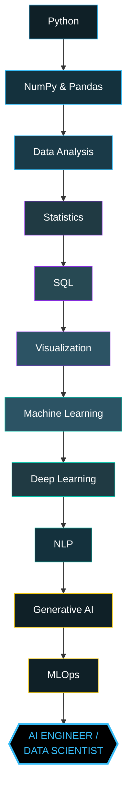
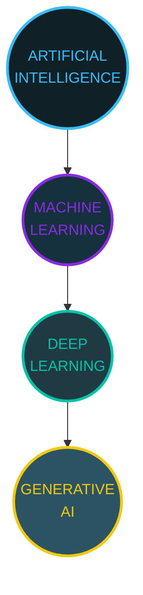
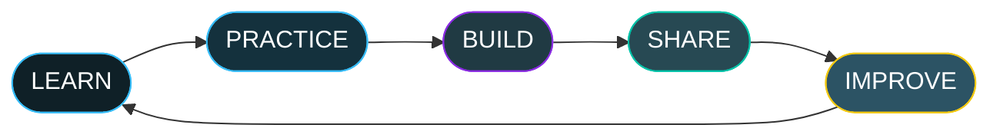
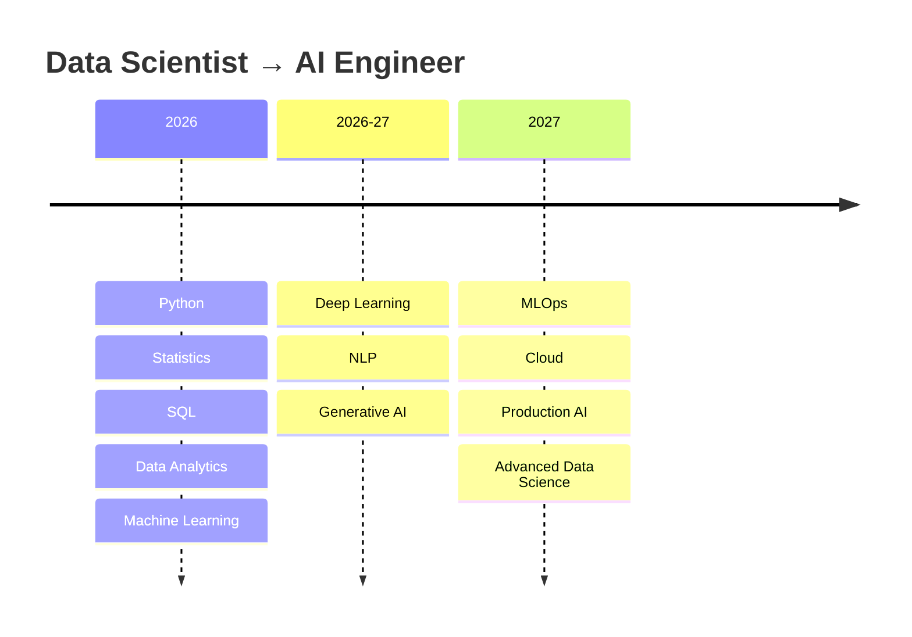

```mermaid
flowchart LR
    A[("DATASET")] --> B["DATA CLEANING"]
    B --> C["EDA"]
    C --> D["FEATURE\nENGINEERING"]
    D --> E["TRAINING"]
    E --> F["EVALUATION"]
    F --> G["HYPERPARAMETER\nTUNING"]
    G --> H["EXPLAINABILITY"]
    H --> I[("DEPLOYMENT")]

    style A fill:#0F2027,stroke:#36BCF7,color:#fff
    style B fill:#14313d,stroke:#36BCF7,color:#fff
    style C fill:#1a3a48,stroke:#8A2BE2,color:#fff
    style D fill:#203A43,stroke:#8A2BE2,color:#fff
    style E fill:#274953,stroke:#00C2A8,color:#fff
    style F fill:#2C5364,stroke:#00C2A8,color:#fff
    style G fill:#203A43,stroke:#F2C811,color:#fff
    style H fill:#14313d,stroke:#F2C811,color:#fff
    style I fill:#000000,stroke:#36BCF7,stroke-width:3px,color:#36BCF7
```

<div align="center">


<a href="https://github.com/NEERAJSINGHDANU07">
  
</a>

<br/>


<br/><br/>


</div>


<h2 align="center">👤 IDENTITY CARD <sub>— Glassmorphism</sub></h2>

<div align="center">

<table>
<tr><td>

```yaml
Name        : Neeraj Singh Danu
Role        : Aspiring Data Scientist
Location    : Haldwani, Uttarakhand, India 🇮🇳
Focus       : Data Science | Machine Learning | Generative AI
Languages   : Python | SQL
Experience  : Continuous, project-driven self-learning
Mission     : "Learn continuously. Build consistently. Improve relentlessly."
Status      : 🟢 Actively building & open to opportunities
```

</td></tr>
</table>


</div>


<h2 align="center">💻 SYSTEM INITIALIZATION <sub>— AI Terminal</sub></h2>

<div align="center">

```txt
┌────────────────────────────────────────────────────────────┐
│  root@neeraj-ds:~$ ./init_profile.sh                        │
├────────────────────────────────────────────────────────────┤
│  > Booting Data Scientist profile...                        │
│  > Loading Python............... [██████████████████] 100%  │
│  > Loading Statistics........... [███████████████░░░]  75%  │
│  > Loading SQL................... [██████████████░░░░]  70%  │
│  > Loading Machine Learning...... [███████████░░░░░░░]  55%  │
│  > Loading Deep Learning......... [████░░░░░░░░░░░░░░]  20%  │
│  > Analyzing datasets...................................OK  │
│  > Building predictive models...........................OK  │
│  > Turning data into insights...........................OK  │
│  > SYSTEM READY ✅  |  Neeraj Singh Danu is online           │
└────────────────────────────────────────────────────────────┘
```

</div>


<h2 align="center">📊 ABOUT ME <sub>— Interactive Dashboard</sub></h2>

<table align="center" width="100%">
<tr>
<td width="25%" align="center" valign="top">

### 🧬 PROFILE
**NAME**
Neeraj Singh Danu
<br/><br/>
Building a career at the intersection of data, statistics and intelligent systems.

</td>
<td width="25%" align="center" valign="top">

### 🎯 ROLE
**Aspiring Data Scientist**
<br/><br/>
Learning end-to-end: from raw data to deployed, explainable models.

</td>
<td width="25%" align="center" valign="top">

### 📍 LOCATION
**Haldwani, Uttarakhand 🇮🇳**
<br/><br/>
Working remotely / open to collaboration across India and globally.

</td>
<td width="25%" align="center" valign="top">

### 🚀 MISSION
**Learn → Build → Deploy → Improve**
<br/><br/>
A continuous loop, not a one-time goal.

</td>
</tr>
</table>

<div align="center">

**🔬 Current Focus Areas**

   

</div>


<h2 align="center">🧠 MY DATA SCIENCE MINDSET</h2>

<div align="center">



```mermaid
flowchart LR
    A([RAW DATA]) --> B([CLEAN])
    B --> C([EXPLORE])
    C --> D([ANALYZE])
    D --> E([MODEL])
    E --> F([EVALUATE])
    F --> G([DEPLOY])
    G --> H([INSIGHT])

    style A fill:#0F2027,stroke:#36BCF7,stroke-width:2px,color:#ffffff
    style B fill:#14313d,stroke:#36BCF7,stroke-width:2px,color:#ffffff
    style C fill:#1a3a48,stroke:#36BCF7,stroke-width:2px,color:#ffffff
    style D fill:#203A43,stroke:#8A2BE2,stroke-width:2px,color:#ffffff
    style E fill:#274953,stroke:#8A2BE2,stroke-width:2px,color:#ffffff
    style F fill:#2C5364,stroke:#8A2BE2,stroke-width:2px,color:#ffffff
    style G fill:#2C5364,stroke:#00C2A8,stroke-width:2px,color:#ffffff
    style H fill:#0F2027,stroke:#00C2A8,stroke-width:3px,color:#36BCF7
```

*This loop repeats for every dataset I touch — nothing skips a step.*

</div>


<h2 align="center">🛠️ TECH STACK <sub>— Technology Cloud</sub></h2>

<div align="center">

**⚡ Languages**
<br/>


**📊 Data Science**
<br/>


**🤖 Machine Learning**
<br/>


**🧰 Tools**
<br/>


**📡 Currently Learning**
<br/>


</div>


<h2 align="center">🚀 MY JOURNEY FROM DATA TO AI</h2>

<div align="center">



</div>


<h2 align="center">📈 SKILL LEVELS <sub>— Futuristic HUD</sub></h2>

<div align="center">

| Skill | HUD Meter | Level |
|---|---|---|
| **Python** | `█████████████████░░░` |  |
| **Statistics** | `███████████████░░░░░` |  |
| **SQL** | `██████████████░░░░░░` |  |
| **Power BI** | `████████████░░░░░░░░` |  |
| **Machine Learning** | `███████████░░░░░░░░░` |  |
| **Deep Learning** | `████░░░░░░░░░░░░░░░░` |  |

</div>


<h2 align="center">🏆 FEATURED PROJECTS <sub>— 3D Project Cards</sub></h2>

<table align="center" width="100%">
<tr>
<td width="50%" valign="top">

#### 📘 Learning Core Python
Structured notebooks covering Python fundamentals, OOP, error handling and file handling — the foundation layer of every project that follows.
<br/>

<br/>
<a href="https://github.com/NEERAJSINGHDANU07"></a>

</td>
<td width="50%" valign="top">

#### 📗 Python Libraries for Data Science
Hands-on notebooks with NumPy, Pandas, Matplotlib, Seaborn and Scikit-learn — from array operations to first ML pipelines.
<br/>
  
<br/>
<a href="https://github.com/NEERAJSINGHDANU07"></a>

</td>
</tr>
<tr>
<td width="50%" valign="top">

#### 📙 Statistics for Data Science
Probability, hypothesis testing, regression, ANOVA and distributions — the mathematical backbone behind every model decision.
<br/>
 
<br/>
<a href="https://github.com/NEERAJSINGHDANU07"></a>

</td>
<td width="50%" valign="top">

#### 📕 Portfolio Website
Personal portfolio showcasing skills, projects and learning journey in a clean, recruiter-friendly layout.
<br/>
  
<br/>
<a href="https://neerajsinghdanu07.github.io/neerajsinghdanu.github.io/"></a>
<a href="https://agent-6a0ab1f8ca1265c--iridescent-gumdrop-325a80.netlify.app"></a>

</td>
</tr>
</table>

<div align="center">

**🔮 In the Pipeline (Coming Soon)**

     

</div>


<h2 align="center">🔄 DATA SCIENCE PROJECT PIPELINE</h2>

<div align="center">



</div>


<h2 align="center">📊 GITHUB ANALYTICS <sub>— Premium Dashboard</sub></h2>

<div align="center">


</div>


<h2 align="center">🐍 CODE THAT NEVER STOPS MOVING</h2>

<div align="center">
  
</div>

> ⚙️ *Powered by the [platane/snk](https://github.com/Platane/snk) GitHub Action — add it to a workflow in this repo and it will auto-render your live contribution snake.*


<h2 align="center">🟢 CURRENTLY LEARNING <sub>— Live System Status</sub></h2>

<div align="center">

| Topic | Status | Indicator |
|---|---|---|
| Machine Learning | ACTIVE | 🟢 |
| Deep Learning | LEARNING | 🟡 |
| Generative AI | EXPLORING | 🔵 |
| Power BI | BUILDING | 🟢 |
| MLOps | UPCOMING | ⚪ |

</div>


<h2 align="center">🌌 AI / ML CONCEPT HIERARCHY</h2>

<div align="center">



**AI** → the broad field of intelligent systems · **ML** → algorithms that learn patterns from data · **DL** → neural-network-based ML · **Generative AI** → models capable of generating new content.

</div>


<h2 align="center">⚙️ WHAT I BUILD</h2>

<table align="center" width="100%">
<tr>
<td align="center" width="16.6%">📊<br/><b>Data Analytics</b><br/><sub>Cleaning raw data into decisions</sub></td>
<td align="center" width="16.6%">🤖<br/><b>ML Models</b><br/><sub>Regression to ensembles</sub></td>
<td align="center" width="16.6%">🧠<br/><b>AI Systems</b><br/><sub>Learning-driven pipelines</sub></td>
<td align="center" width="16.6%">📈<br/><b>Dashboards</b><br/><sub>Power BI, data storytelling</sub></td>
<td align="center" width="16.6%">🔍<br/><b>Predictive Analytics</b><br/><sub>Forecasting & trends</sub></td>
<td align="center" width="16.6%">🔁<br/><b>Automation</b><br/><sub>Python-powered workflows</sub></td>
</tr>
</table>


<h2 align="center">💭 LEARNING PHILOSOPHY</h2>

<div align="center">

### *"Every dataset tells a story.*
### *My job is to uncover it."*



</div>


<h2 align="center">🗺️ FUTURE ROADMAP 2026 → 2027</h2>

<div align="center">



### 🎯 `DATA SCIENTIST → AI ENGINEER`

</div>


<h2 align="center">🌐 CONNECT WITH ME <sub>— Social Hub</sub></h2>

<div align="center">

<a href="https://github.com/NEERAJSINGHDANU07"></a>
<a href="https://linkedin.com/in/neerajsinghdanu"></a>
<a href="http://www.youtube.com/@CODEVERTEX-k7c"></a>
<a href="mailto:neerajdanu07@gmail.com"></a>
<a href="https://neerajsinghdanu07.github.io/neerajsinghdanu.github.io/"></a>

</div>


<div align="center">

## 🚀 BUILDING THE FUTURE, ONE DATASET AT A TIME.

### Consistency Today → Mastery Tomorrow

⭐ *If you like my work, consider following my journey!*


</div>
