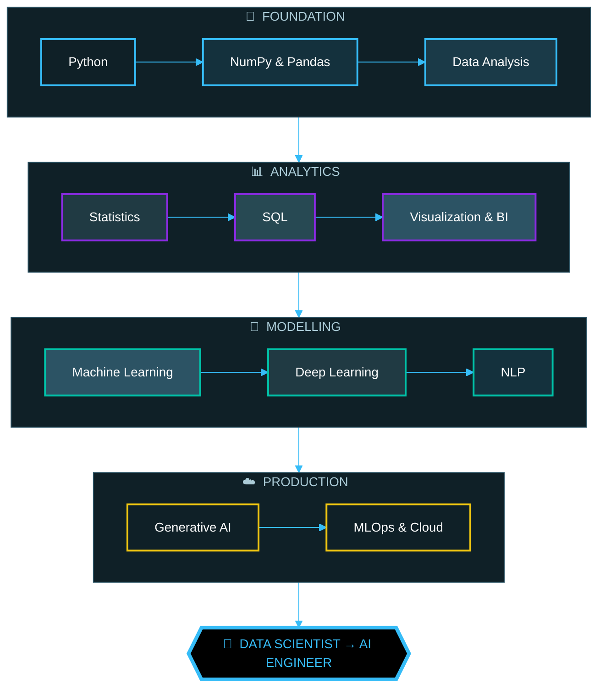
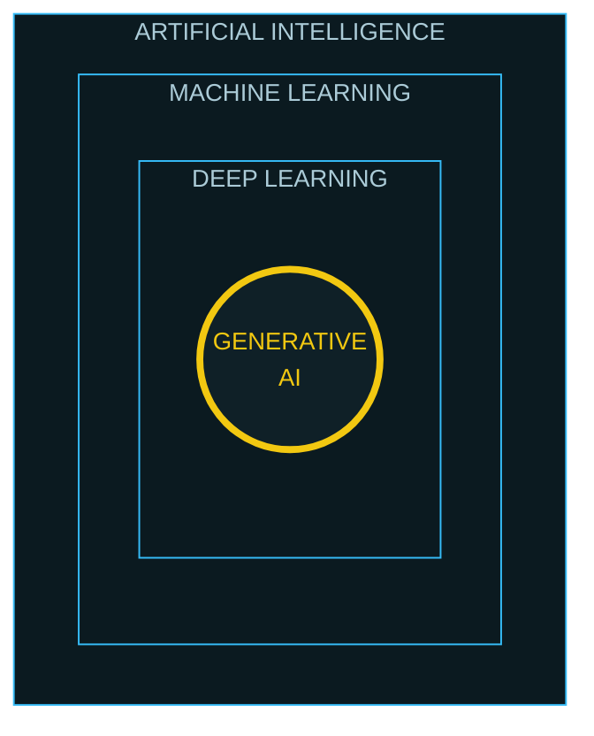
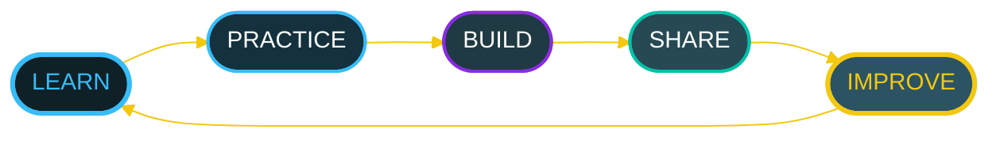
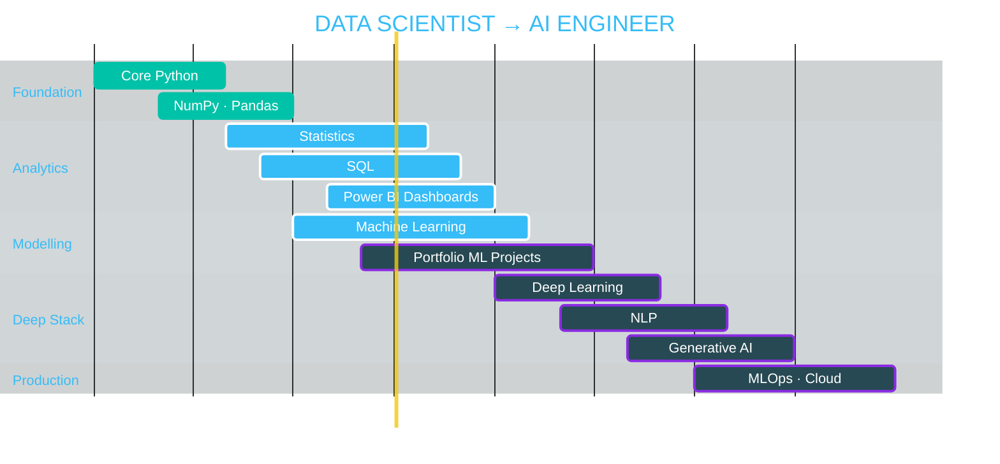

```mermaid
%%{init: {'theme':'base','themeVariables':{'fontFamily':'Fira Code, monospace','fontSize':'15px','primaryColor':'#203A43','primaryTextColor':'#FFFFFF','primaryBorderColor':'#36BCF7','lineColor':'#8A2BE2','tertiaryColor':'#0F2027'}}}%%
flowchart LR
    A([RAW DATA]) --> B([CLEAN])
    B --> C([EXPLORE])
    C --> D([ANALYZE])
    D --> E([MODEL])
    E --> F([EVALUATE])
    F --> G([DEPLOY])
    G --> H([INSIGHT])
    H -.->|next dataset| A

    style A fill:#0F2027,stroke:#36BCF7,stroke-width:3px,color:#36BCF7
    style B fill:#14313D,stroke:#36BCF7,stroke-width:2px,color:#FFFFFF
    style C fill:#1A3A48,stroke:#36BCF7,stroke-width:2px,color:#FFFFFF
    style D fill:#203A43,stroke:#8A2BE2,stroke-width:2px,color:#FFFFFF
    style E fill:#274953,stroke:#8A2BE2,stroke-width:2px,color:#FFFFFF
    style F fill:#2C5364,stroke:#8A2BE2,stroke-width:2px,color:#FFFFFF
    style G fill:#2C5364,stroke:#00C2A8,stroke-width:3px,color:#FFFFFF
    style H fill:#0F2027,stroke:#F2C811,stroke-width:4px,color:#F2C811
```

```mermaid
%%{init: {'theme':'base','themeVariables':{'fontFamily':'Fira Code, monospace','fontSize':'14px','primaryColor':'#203A43','primaryTextColor':'#FFFFFF','primaryBorderColor':'#36BCF7','lineColor':'#00C2A8'}}}%%
flowchart LR
    A[("DATASET")] --> B["DATA<br/>CLEANING"]
    B --> C["EDA"]
    C --> D["FEATURE<br/>ENGINEERING"]
    D --> E["TRAINING"]
    E --> F["EVALUATION"]
    F --> G["HYPERPARAMETER<br/>TUNING"]
    G -.->|"if metrics<br/>fall short"| D
    G --> H["EXPLAINABILITY"]
    H --> I[("DEPLOYMENT")]

    style A fill:#0F2027,stroke:#36BCF7,stroke-width:3px,color:#36BCF7
    style B fill:#14313D,stroke:#36BCF7,stroke-width:2px,color:#FFFFFF
    style C fill:#1A3A48,stroke:#8A2BE2,stroke-width:2px,color:#FFFFFF
    style D fill:#203A43,stroke:#8A2BE2,stroke-width:2px,color:#FFFFFF
    style E fill:#274953,stroke:#00C2A8,stroke-width:2px,color:#FFFFFF
    style F fill:#2C5364,stroke:#00C2A8,stroke-width:2px,color:#FFFFFF
    style G fill:#203A43,stroke:#F2C811,stroke-width:2px,color:#FFFFFF
    style H fill:#14313D,stroke:#F2C811,stroke-width:2px,color:#FFFFFF
    style I fill:#000000,stroke:#36BCF7,stroke-width:4px,color:#36BCF7
```

<!--
════════════════════════════════════════════════════════════════════════════
  NEERAJ SINGH DANU  ·  GITHUB PROFILE README
════════════════════════════════════════════════════════════════════════════
  BEFORE YOU COMMIT — replace these 3 things (search for "REPLACE"):
    1. REPLACE-REPO-1 ... REPLACE-REPO-4  -> your real repository URLs
    2. Check the dates in the ROADMAP gantt section match your plan
    3. Optional: enable the 2 GitHub Actions listed at the bottom of this file
       (contribution snake + 3D isometric calendar). Instructions are there.
  Everything else works out of the box. No extra files needed.
════════════════════════════════════════════════════════════════════════════
-->

<div align="center">


<a href="https://github.com/NEERAJSINGHDANU07">
  
</a>

<br/>


<br/><br/>


</div>

<!-- ══════════════════════════ IDENTITY CARD ══════════════════════════ -->

<div align="center">


</div>

```yaml
╭──────────────────────────────────────────────────────────────╮
│  NEERAJ SINGH DANU                                           │
╰──────────────────────────────────────────────────────────────╯

name        : Neeraj Singh Danu
role        : Aspiring Data Scientist
location    : Haldwani, Uttarakhand, India
focus       : [ Data Science, Machine Learning, Generative AI ]
languages   : [ Python, SQL ]
tools       : [ Pandas, NumPy, Scikit-learn, Power BI, MySQL, Git ]
learning    : Statistics · Machine Learning · Deep Learning
mission     : "Learn continuously. Build consistently. Improve relentlessly."
open_to     : [ Internships, Junior DS roles, Open Source, Collaboration ]
status      : ACTIVELY BUILDING
```

<div align="center">


</div>

<!-- ══════════════════════ SYSTEM INITIALIZATION ══════════════════════ -->

<div align="center">


</div>

```console
  ┌──────────────────────────────────────────────────────────────┐
  │  root@neeraj-ds:~$ ./init_profile.sh --mode=production       │▓
  ├──────────────────────────────────────────────────────────────┤▓
  │                                                              │▓
  │  > booting data scientist profile ................. ONLINE   │▓
  │                                                              │▓
  │    python .................. ███████████████████░  strong    │▓
  │    statistics .............. ████████████████░░░░  building  │▓
  │    sql ..................... ███████████████░░░░░  building  │▓
  │    power bi ................ █████████████░░░░░░░  building  │▓
  │    machine learning ........ ████████████░░░░░░░░  learning  │▓
  │    deep learning ........... █████░░░░░░░░░░░░░░░  exploring │▓
  │                                                              │▓
  │  > loading pandas · numpy · sklearn ................... OK    │▓
  │  > mounting notebooks/ ................................ OK    │▓
  │  > cleaning datasets .................................. OK    │▓
  │  > fitting models ..................................... OK    │▓
  │  > extracting insight ................................. OK    │▓
  │                                                              │▓
  │  ✔ SYSTEM READY   ·   Neeraj Singh Danu is online            │▓
  └──────────────────────────────────────────────────────────────┘▓
    ▓▓▓▓▓▓▓▓▓▓▓▓▓▓▓▓▓▓▓▓▓▓▓▓▓▓▓▓▓▓▓▓▓▓▓▓▓▓▓▓▓▓▓▓▓▓▓▓▓▓▓▓▓▓▓▓▓▓▓▓▓▓
```

<div align="center">


</div>

<!-- ═════════════════════════════ ABOUT ME ════════════════════════════ -->

<div align="center">


</div>

<table align="center" width="100%">
<tr>
<td width="25%" align="center" valign="top">
<h3>🧬 &nbsp;PROFILE</h3>
<b>Neeraj Singh Danu</b>
<br/><br/>
<sub>Building a career at the intersection of data, statistics and intelligent systems. Self-taught, project-driven, consistent.</sub>
</td>
<td width="25%" align="center" valign="top">
<h3>🎯 &nbsp;ROLE</h3>
<b>Aspiring Data Scientist</b>
<br/><br/>
<sub>Learning the full loop — raw data, clean features, honest evaluation, explainable models.</sub>
</td>
<td width="25%" align="center" valign="top">
<h3>📍 &nbsp;LOCATION</h3>
<b>Haldwani, Uttarakhand 🇮🇳</b>
<br/><br/>
<sub>Remote-friendly. Open to collaboration across India and globally.</sub>
</td>
<td width="25%" align="center" valign="top">
<h3>🚀 &nbsp;MISSION</h3>
<b>Learn → Build → Deploy</b>
<br/><br/>
<sub>A continuous loop, not a one-time goal. Every project ships something I can defend.</sub>
</td>
</tr>
</table>

<div align="center">

<b>🔬 &nbsp;CURRENT FOCUS AREAS</b>

<br/><br/>


</div>

<!-- ═══════════════════════ DATA SCIENCE MINDSET ══════════════════════ -->

<div align="center">


</div>



<div align="center">

<i>This loop repeats for every dataset I touch — nothing skips a step.</i>


</div>

<!-- ════════════════════════════ TECH STACK ═══════════════════════════ -->

<div align="center">


<br/>

<b>⚡ &nbsp;LANGUAGES & CORE</b>

<br/><br/>


<br/><br/>

<b>📊 &nbsp;DATA SCIENCE STACK</b>

<br/><br/>


<br/><br/>

<b>🤖 &nbsp;MACHINE LEARNING</b>

<br/><br/>


<br/>


<br/><br/>

<b>🧰 &nbsp;TOOLS & ENVIRONMENT</b>

<br/><br/>


<br/>


<br/>


<br/><br/>

<b>📡 &nbsp;CURRENTLY LEVELLING UP</b>

<br/><br/>


</div>

<!-- ═══════════════════════ JOURNEY: DATA TO AI ═══════════════════════ -->

<div align="center">


</div>



<div align="center">


</div>

<!-- ═════════════════════════ LEARNING PROGRESS ═══════════════════════ -->

<div align="center">


<sub><i>Self-tracked against my own roadmap — not a certification claim.</i></sub>

<br/><br/>

<table>
<tr>
<th align="left">SKILL</th>
<th align="center">DEPTH METER</th>
<th align="center">STAGE</th>
<th align="left">WHAT I CAN DO TODAY</th>
</tr>
<tr>
<td><b>🐍 Python</b></td>
<td><code>███████████████▓▓▒░</code></td>
<td></td>
<td><sub>OOP, file & error handling, clean reusable scripts</sub></td>
</tr>
<tr>
<td><b>📐 Statistics</b></td>
<td><code>█████████████▓▒░░░░</code></td>
<td></td>
<td><sub>Hypothesis tests, distributions, regression, ANOVA</sub></td>
</tr>
<tr>
<td><b>🗄 SQL</b></td>
<td><code>████████████▓▒░░░░░</code></td>
<td></td>
<td><sub>Joins, aggregations, subqueries, window functions</sub></td>
</tr>
<tr>
<td><b>📊 Power BI</b></td>
<td><code>██████████▓▒░░░░░░░</code></td>
<td></td>
<td><sub>Data modelling, DAX basics, interactive dashboards</sub></td>
</tr>
<tr>
<td><b>🤖 Machine Learning</b></td>
<td><code>█████████▓▒░░░░░░░░</code></td>
<td></td>
<td><sub>End-to-end sklearn pipelines, CV, metric selection</sub></td>
</tr>
<tr>
<td><b>🧠 Deep Learning</b></td>
<td><code>████▒░░░░░░░░░░░░░░</code></td>
<td></td>
<td><sub>Neural net fundamentals, backprop intuition</sub></td>
</tr>
</table>


</div>

<!-- ═════════════════════════ FEATURED PROJECTS ═══════════════════════ -->

<div align="center">


</div>

<table align="center" width="100%">
<tr>
<td width="50%" valign="top">

<h3>📘 &nbsp;Learning Core Python</h3>

<sub>Structured notebooks covering Python fundamentals, OOP, error handling and file I/O — the foundation layer every later project builds on.</sub>

<br/><br/>


<br/><br/>

<!-- REPLACE-REPO-1 : point this at the real repository -->
<a href="https://github.com/NEERAJSINGHDANU07?tab=repositories"></a>

</td>
<td width="50%" valign="top">

<h3>📗 &nbsp;Python Libraries for Data Science</h3>

<sub>Hands-on notebooks with NumPy, Pandas, Matplotlib, Seaborn and scikit-learn — from array operations to a first end-to-end ML pipeline.</sub>

<br/><br/>


<br/><br/>

<!-- REPLACE-REPO-2 : point this at the real repository -->
<a href="https://github.com/NEERAJSINGHDANU07?tab=repositories"></a>

</td>
</tr>
<tr>
<td width="50%" valign="top">

<h3>📙 &nbsp;Statistics for Data Science</h3>

<sub>Probability, hypothesis testing, regression, ANOVA and distributions — worked through in Python. The mathematical backbone behind every model decision.</sub>

<br/><br/>


<br/><br/>

<!-- REPLACE-REPO-3 : point this at the real repository -->
<a href="https://github.com/NEERAJSINGHDANU07?tab=repositories"></a>

</td>
<td width="50%" valign="top">

<h3>📕 &nbsp;Portfolio Website</h3>

<sub>Personal portfolio built from scratch — skills, projects and learning journey in a clean, recruiter-friendly layout. Deployed and live.</sub>

<br/><br/>


<br/><br/>

<a href="https://neerajsinghdanu07.github.io/neerajsinghdanu.github.io/"></a>
<!-- REPLACE-REPO-4 : point this at the real repository -->
<a href="https://github.com/NEERAJSINGHDANU07?tab=repositories"></a>

</td>
</tr>
</table>

<div align="center">

<b>🔮 &nbsp;IN THE PIPELINE</b>

<br/><br/>


<br/>


</div>

<!-- ═════════════════════════ PROJECT PIPELINE ════════════════════════ -->

<div align="center">


</div>



<div align="center">


</div>

<!-- ═════════════════════════ GITHUB ANALYTICS ════════════════════════ -->

<div align="center">


<br/>


<br/>


<br/><br/>


<br/>


</div>

<!-- ══════════════════════════ CURRENT STATUS ═════════════════════════ -->

<div align="center">


<br/>

<table>
<tr>
<th align="left">TOPIC</th>
<th align="center">STATE</th>
<th align="center">SIGNAL</th>
<th align="left">RIGHT NOW</th>
</tr>
<tr>
<td><b>Machine Learning</b></td>
<td></td>
<td align="center">🟢</td>
<td><sub>Supervised models · evaluation metrics</sub></td>
</tr>
<tr>
<td><b>Statistics</b></td>
<td></td>
<td align="center">🟢</td>
<td><sub>Inference · hypothesis testing</sub></td>
</tr>
<tr>
<td><b>Power BI</b></td>
<td></td>
<td align="center">🟢</td>
<td><sub>Dashboards from real datasets</sub></td>
</tr>
<tr>
<td><b>Deep Learning</b></td>
<td></td>
<td align="center">🟡</td>
<td><sub>Neural network fundamentals</sub></td>
</tr>
<tr>
<td><b>Generative AI</b></td>
<td></td>
<td align="center">🔵</td>
<td><sub>Prompting · embeddings · RAG basics</sub></td>
</tr>
<tr>
<td><b>MLOps</b></td>
<td></td>
<td align="center">⚪</td>
<td><sub>Next after the DL block</sub></td>
</tr>
</table>


</div>

<!-- ══════════════════════ AI / ML CONCEPT MAP ════════════════════════ -->

<div align="center">


</div>



<div align="center">

<table>
<tr>
<td align="center"><b>🌐 AI</b><br/><sub>the broad field of<br/>intelligent systems</sub></td>
<td align="center"><b>📈 ML</b><br/><sub>algorithms that learn<br/>patterns from data</sub></td>
<td align="center"><b>🧠 DL</b><br/><sub>neural-network<br/>based ML</sub></td>
<td align="center"><b>✨ GenAI</b><br/><sub>models that generate<br/>new content</sub></td>
</tr>
</table>


</div>

<!-- ═══════════════════════════ WHAT I BUILD ══════════════════════════ -->

<div align="center">


</div>

<table align="center" width="100%">
<tr>
<td align="center" width="16.6%"><h3>📊</h3><b>Data Analytics</b><br/><sub>Turning messy raw data into decisions</sub></td>
<td align="center" width="16.6%"><h3>🤖</h3><b>ML Models</b><br/><sub>Regression through to ensembles</sub></td>
<td align="center" width="16.6%"><h3>🧠</h3><b>AI Systems</b><br/><sub>Learning-driven pipelines</sub></td>
<td align="center" width="16.6%"><h3>📈</h3><b>Dashboards</b><br/><sub>Power BI &amp; data storytelling</sub></td>
<td align="center" width="16.6%"><h3>🔍</h3><b>Predictive Analytics</b><br/><sub>Forecasting &amp; trend detection</sub></td>
<td align="center" width="16.6%"><h3>🔁</h3><b>Automation</b><br/><sub>Python-powered workflows</sub></td>
</tr>
</table>

<div align="center">


</div>

<!-- ═════════════════════════════ PHILOSOPHY ══════════════════════════ -->

<div align="center">


<br/>


</div>



<div align="center">


</div>

<!-- ════════════════════════════ ROADMAP ══════════════════════════════ -->

<div align="center">


</div>



<div align="center">


</div>

<!-- ═════════════════════════════ CONNECT ═════════════════════════════ -->

<div align="center">


<br/>

<a href="https://github.com/NEERAJSINGHDANU07"></a>
<a href="https://linkedin.com/in/neerajsinghdanu"></a>
<a href="https://www.youtube.com/@CODEVERTEX-k7c"></a>
<a href="mailto:neerajdanu07@gmail.com"></a>
<a href="https://neerajsinghdanu07.github.io/neerajsinghdanu.github.io/"></a>

<br/><br/>


<h2>🚀 &nbsp;BUILDING THE FUTURE, ONE DATASET AT A TIME</h2>

<h3>Consistency today → Mastery tomorrow</h3>

<sub>⭐ If any of this is useful to you, a follow or a star means a lot.</sub>

<br/>


</div>

<!--
════════════════════════════════════════════════════════════════════════════
  OPTIONAL SUPERCHARGE — TWO REAL 3D / ANIMATED EXTRAS
════════════════════════════════════════════════════════════════════════════

  These need a GitHub Action to generate an SVG into your own repo. Once the
  workflow has run once, delete the surrounding comment markers around the
  matching block below and the animation goes live with YOUR data.

  ── A. 3D ISOMETRIC CONTRIBUTION CALENDAR ────────────────────────────────
  Create .github/workflows/profile-3d.yml with:

      name: GitHub-Profile-3D-Contrib
      on:
        schedule: [{ cron: "0 18 * * *" }]
        workflow_dispatch:
      jobs:
        build:
          runs-on: ubuntu-latest
          permissions:
            contents: write
          steps:
            - uses: actions/checkout@v4
            - uses: yoshi389111/github-profile-3d-contrib@main
              env:
                GITHUB_TOKEN: ${{ secrets.GITHUB_TOKEN }}
                USERNAME: ${{ github.repository_owner }}
            - name: Commit & push
              run: |
                git config user.name  github-actions
                git config user.email actions@github.com
                git add -A .
                git commit -m "generate 3d contrib" || exit 0
                git push

  Then run it once from the Actions tab, and un-comment:

  <div align="center">
    
  </div>

  ── B. CONTRIBUTION SNAKE (your data, not someone else's) ─────────────────
  Your old README pointed at platane/snk's own output branch, so it was
  showing THEIR contributions. Create .github/workflows/snake.yml with:

      name: Generate Snake
      on:
        schedule: [{ cron: "0 */12 * * *" }]
        workflow_dispatch:
      jobs:
        build:
          runs-on: ubuntu-latest
          permissions:
            contents: write
          steps:
            - uses: Platane/snk@v3
              id: snake-gif
              with:
                github_user_name: ${{ github.repository_owner }}
                outputs: |
                  dist/github-snake-dark.svg?palette=github-dark
            - uses: crazy-max/ghaction-github-pages@v4
              with:
                target_branch: output
                build_dir: dist
              env:
                GITHUB_TOKEN: ${{ secrets.GITHUB_TOKEN }}

  Then un-comment (replace USERNAME if different):

  <div align="center">
    
  </div>

════════════════════════════════════════════════════════════════════════════
-->
